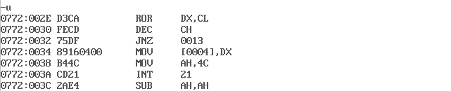

## 两个非压缩的BCD数的加法

非压缩BCD数，一个数字就占一个字节，加数被放在SBCD1为首地址的顺序单元中，加数放在以SBCD2为首地址的顺序单元中
考虑到是４位BCD数相加，那么应该使用5个字节去存储结果。

``` Assembly
STACK	SEGMENT	PARA	STACK	'STACK'
		DB	200	DUP(?)
STACK	ENDS
DATA	SEGMENT
SBCD1	DB	5, 6, 9, 2;2965
SBCD2	DB	2, 3, 7, 8;8732
SSUM	DB	5	DUP(0);５个字节去存储结果 算式为2965+8732=11697
CONT	DB	4
DATA	ENDS
CODE	SEGMENT
		ASSUME	CS:CODE, DS:DATA, SS:STACK, ES:DATA
SBCDAD:	MOV	AX,	DATA
		MOV	DS,	AX
		MOV	ES,	AX
		CLC
		CLD;DF=0 与LODSB操作有关，使LODSB后SI自动加1
		MOV	SI,	OFFSET	SBCD1
		MOV DI, OFFSET	SBCD2
		MOV	BX,	OFFSET	SSUM
		MOV	CL,	CONT
		MOV	CH,	0
		MOV AX, 0;AX清零
SBCDAD1:LODSB;把[SI]的数据送入AL，并使得SI++（DF=0）
		ADC	AL, [DI]
		AAA;对未压缩的BCD数之和做调整
		INC	DI
		MOV	BYTE PTR[BX], AL
		INC BX
		LOOP SBCDAD1
		MOV	BYTE PTR[BX], AL;把万位送给以SSUM为首地址的第五个顺序单元
		MOV	AH,	4CH
		INT	21H
CODE	ENDS
		END	SBCDAD
```

### DEBUG

* 首先查看代码: _u 0 29


可以看出数据段的**段地址为0777**, 结果SSUM的首个单元的偏移地址为**0008**

* 运行: _g=0 27
在`MOV AH,4C`处打断点


* 结果查看: _d 0777:0


只需查看0777:0000即可
SSUM的首个单元的偏移地址为**0008**,那么从第9个单元到第13个单元的值连起来为11697
**结果正确**

## 二进制加法程序

两个多字节的二进制树分别放在以ADD1和ADD2为首地址的存储单元中,两数之和放在以SUM为首地址的单元中,低字节在前。

``` Assembly
STACK	SEGMENT PARA STACK 'STACK'
		DB 100 DUP(?)
STACK	ENDS
DATA	SEGMENT
ADD1 	DB 0FEH, 86H, 7CH, 23H, 0A7H, 26H
ADD2	DB 0B3H, 73H, 11H, 9FH, 46H, 3EH
SUM		DB 6 DUP(0);算式为:26A7237C86FEH+3E469F1173B3H=64EDC28DFAB1H
CONT	DB 3
DATA	ENDS
CODE	SEGMENT
		ASSUME CS:CODE, SS:STACK, DS:DATA, ES:DATA
MADDB:	MOV AX, DATA
		MOV DS, AX
		MOV ES, AX
		MOV SI, OFFSET ADD1
		MOV DI, OFFSET ADD2
		MOV BX, OFFSET SUM
		MOV CL, BYTE PTR CONT
		MOV CH, 0
		CLC
MADDB1:	MOV AX, [SI]
		ADC AX, [DI]
		INC SI
		INC SI
		INC DI
		INC DI
		MOV [BX], AX
		INC BX
		INC BX
		LOOP MADDB1
		MOV AH, 4CH
		INT 21H
CODE	ENDS
		END MADDB
```

### DEBUG

* 首先查看代码:_u 0 27

可以看出**数据段的段地址为0771**,结果SUM的首个单元的偏移地址为**000C**

* 运行:_g=0 25 在`MOV AH, 4C`处打断点


* 结果查看: _d 0771:0

从0771:000C到0771:0011为结果,结果为64EDC28DFAB1H
**结果正确**

## 排序，由大到小排序

偏移地址从BUFFER开始顺序存放5个无符号8位数。对这五个数进行排列

``` Assembly
STACK	SEGMENT	PARA	STACK	'STACK'
		DB	200	DUP(?)
STACK	ENDS
DATA	SEGMENT
BUFFER  DB  0A5H, 43H, 11H, 0C6H, 71H;正确的排列为C6H A5H 71H 43H 11H
CONT	DB	4
DATA	ENDS
CODE	SEGMENT
		ASSUME	CS:CODE, DS:DATA, SS:STACK, ES:DATA
SORT:   MOV AX, DATA;采用冒泡排序
		MOV DS, AX
		MOV ES, AX
        LEA DI, BUFFER
        MOV BL, CONT
        MOV AX, 0
        MOV DX, 0
NEXT0:  MOV SI, DI
        MOV CL, BL
NEXT2:  MOV AL, [SI]
        INC SI
        CMP AL, [SI]
        JNC NEXT3;如果AL>[SI]则继续开始内层循环　反之交互[SI]和[SI-1]的位置
        MOV DX, [SI]
        MOV [SI-1], DL
        MOV [SI],   AL
NEXT3:  DEC CL
        JNZ NEXT2;内层循环
        DEC BL
        JNZ NEXT0;外层循环
		MOV AH, 4CH
		INT 21H
CODE	ENDS
		END	SORT
```

### DEBUG

* 首先查看代码:_u 0 31

可以看出**数据段的段地址为0777**,结果BUFFER的首个单元的偏移地址为**0000**

* 运行:_g=0 2F 在`MOV AH, 4C`处打断点


* 结果查看: _d 0777:0

从0777:0000到0777:0004为结果,结果为C6H A5H 71H 43H 11H
**结果正确**

## 二进制数转成ASCII码

将一个字长的二进制数转换成ASCII码表示的字符串。二进制数放在BINNUM，结果放在ASCBCD为首地址的顺序单元中

```Assembly
STACK	SEGMENT PARA STACK 'STACK'
		DB 100 DUP(?)
STACK	ENDS
DATA	SEGMENT
BINNUM  DW  4FFFH;20479D
ASCDCD  DB  5 DUP(0)
DATA	ENDS
CODE	SEGMENT
		ASSUME CS:CODE, SS:STACK, DS:DATA, ES:DATA
B2A:	MOV AX, DATA
		MOV DS, AX
		MOV ES, AX
		MOV CX, 5;4FFFH=20479D　一共有5个数
        XOR DX, DX;清零DX
        MOV BX, 10
        MOV AX, BINNUM
        MOV DI, OFFSET  ASCDCD
B2A1:   DIV BX;AX/BX 商放在AX,余数放在DX　取AX的最后一位 并且把AX/10的结果给AX
        ADD DL, 30H;DL+48 ASCII与数字的转化　'0' = 48D = 30H
        MOV [DI],   DL
        INC DI
        AND AX, AX;CF清零
        CMP CX, 5
        JC  STOP;如果AX全0，说明转换结束，跳出
        MOV DL, 0
        LOOP    B2A1
STOP:   MOV AH, 4CH
        INT 21H
CODE	ENDS
		END B2A
```

### DEBUG

* 首先查看代码:_u 0 27

可以看出**数据段的段地址为0771**,结果ASCBCD的首个单元的偏移地址为**0002**

* 运行:_g=0 25 在`MOV AH, 4C`处打断点


* 结果查看: _d 0771:0

最右边直接反映结果97402  4FFFH=20749
**结果正确**

## ASCII码转16进制
将4位ASCII码转为十六进制数，ASCII码存放在以ASCSTF为首地址的内存单元中，转换结果放在BIN为首地址的内存单元中
```Assembly
STACK	SEGMENT PARA STACK 'STACK'
	DB 100 DUP(?)
STACK	ENDS
DATA	SEGMENT
ASCSTG  DB  '5', 'A', '6', '1';16A5
BIN     DB  2 DUP(0)
DATA	ENDS
CODE	SEGMENT
	ASSUME CS:CODE, SS:STACK, DS:DATA, ES:DATA
A2H:	MOV AX, DATA
	MOV DS, AX
	MOV ES, AX
	MOV CL, 4;
        MOV CH, CL
        MOV SI, OFFSET  ASCSTG
        CLD;DF=0
        XOR AX, AX;AX=0
        XOR DX, DX;DX=0
A2H1:   LODSB;    ASCSTG;
        AND AL, 7FH;AL与01111111B，ASCII码一共能表示128个字符
        CMP AL, '0';AL小于'0'的ASCII码值说明不能转换，跳出
        JL  ERROR;
        CMP AL, '9';AL大于'9'的ASCII值需要进一步判断AL是否为A-F对应的ASCII码
        JG  A2H2
        SUB AL, 30H; num = ascii-30H
        JMP SHORT   A2H3
A2H2:   CMP AL, 'A'
        JL  ERROR
        CMP AL, 'F'
        JG  ERROR
        SUB AL, 37H; AH = ascii - 37H = 10D
A2H3:   OR  DL, AL;AL只有低4位有值，其余为0，把AL的低4位给DL的低４位，不改变DX的其他位
        ROR DX, CL;DX右移4次,把低四位移至最高位
        DEC CH
        JNZ A2H1
        MOV WORD PTR BIN, DX
ERROR:  MOV AH, 4CH
        INT 21H
CODE	ENDS
	END A2H
```

### DEBUG

* 首先查看代码:
_u 0 34
_u


可以看出**数据段的段地址为0771**,结果ASCBCD的首个单元的偏移地址为**0004**

* 运行:_g=0 38 在`MOV AH, 4C`处打断点


* 结果查看: _d 0771:0

**结果正确**